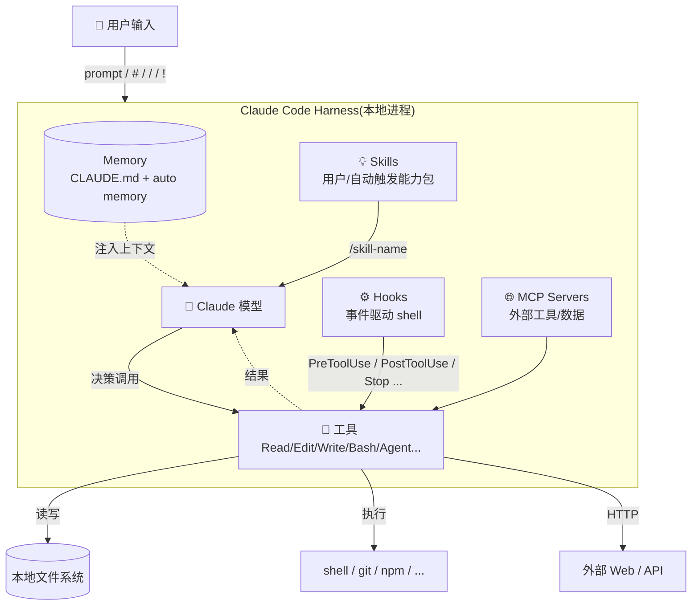

# 一图看懂核心概念



## 五个角色,各管什么

### 1. 模型(Claude)

- 你输入的 prompt 进来,**它决定调用哪些工具**
- 它看不到的,你也无法让它处理
- 它的能力上限来自模型版本(Opus / Sonnet / Haiku)

### 2. 工具(Tools)

> "Claude 能做什么物理动作"的边界

- `Read` / `Edit` / `Write` — 文件读写
- `Bash` — 跑 shell 命令(也是访问 git / npm / 编译器的方式)
- `Agent` — 派生子代理执行子任务
- `WebFetch` / `WebSearch` — 访问网络
- `Glob` / `Grep` — 高效查找

工具调用前由 **权限模型** 决定是否需要询问你。

### 3. Skills(技能)

> "可以一句话触发的能力包"

- **用户可调用**:你打 `/review`、`/init`、`/loop` 等就触发
- **自动触发**:某些 skill 注册了触发条件(如代码涉及 Anthropic SDK 自动加载 `claude-api` skill)

每个 skill 是一段打包的 prompt + 工具配置 + 触发条件,本质是**给模型加一段精确指令**。

### 4. Hooks(钩子)

> "确定性的本地脚本,不靠模型决策"

| 事件 | 何时触发 | 典型用途 |
| --- | --- | --- |
| `PreToolUse` | 工具调用前 | 阻断危险命令、改写参数 |
| `PostToolUse` | 工具调用后 | 自动 lint / format |
| `UserPromptSubmit` | 用户提交输入时 | 注入额外上下文、敏感词检查 |
| `Stop` | 模型完成回答 | 触发提醒、采集反馈 |
| `SessionStart` / `SessionEnd` | 会话起止 | 加载/保存环境 |

Skills 是"模型层智能",Hooks 是"系统层自动化"。

### 5. Memory(记忆)

两套机制,**职责不同**:

| 层级 | 文件 | 用途 |
| --- | --- | --- |
| **项目记忆** | `CLAUDE.md`(仓库根)、`.claude/CLAUDE.md`、子目录 `CLAUDE.md` | 项目约定、命令、注意事项 |
| **跨会话自动记忆** | `~/.claude/projects/<repo>/memory/` 下的多个 `.md` | 用户角色、反馈、项目动态、外部资源指针 |

两者会**同时**注入到 Claude 的系统提示,让模型知道"你是谁、项目长什么样"。

## 一段对话里发生了什么

```
你输入:! npm test  → 走的是 shell 前缀,输出注入对话
你输入:/review     → 走 skill,Claude 加载 review 的指令
你输入:#测试要并发 → 走记忆写入(由 Claude 判断该写哪一层)
你输入:正常 prompt → 模型决策,调用工具,Hooks 在事件点插入

整个过程中:
- CLAUDE.md & auto memory:在系统提示里持续陪跑
- Hooks:在工具事件前后默默执行
- 权限模型:决定哪些工具调用要按 y 才能放行
```

## 接下来

入门部分到此结束,进入 → [核心概念](/core-concepts/) 逐个深入。
